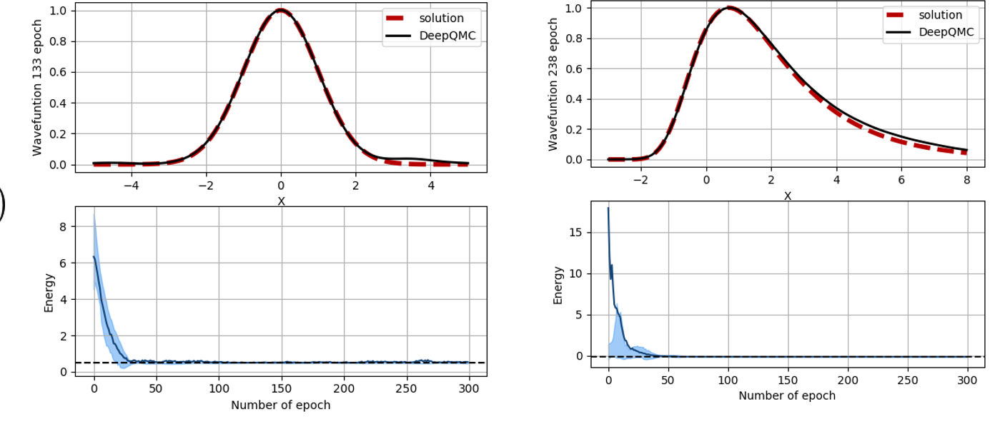

# Schrodinet

Solving the Schrodinger equations in 1, 2 or 3D  using QMC and RBF neural networks

## Harmonic Oscillator in 1D

The script below illustrates how to optimize the wave function of the one-dimensional harmonic oscillator.

```python
import torch
import torch.optim as optim

from schrodinet.sampler.metropolis import  Metropolis
from schrodinet.wavefunction.wf_potential import Potential
from schrodinet.solver.solver_potential import SolverPotential
from schrodinet.solver.plot_potential import plot_results_1d, plotter1d

# analytic solution of the problem
def sol_func(pos):
    return torch.exp(-0.5*pos**2)

# box
domain, ncenter = {'xmin':-5.,'xmax':5.}, 5

# potential function
def pot_func(pos):
    '''Potential function desired.'''
    return  0.5*pos**2

# wavefunction
wf = Potential(pot_func,domain,ncenter,nelec=1)

#sampler
sampler = Metropolis(nwalkers=250, nstep=1000,
                     step_size = 1., nelec = wf.nelec,
                     ndim = wf.ndim, domain = {'min':-5,'max':5})

# optimizer
opt = optim.Adam(wf.parameters(),lr=0.01)

# define solver
solver = SolverPotential(wf=wf,sampler=sampler,optimizer=opt)

# train the wave function
plotter = plotter1d(wf,domain,50,sol=sol_func)
solver.run(100, loss = 'variance', plot = plotter )


# plot the final wave function
plot_results_1d(solver,domain,50,sol_func,e0=0.5)
```

After otpimization the following trajectory can easily be generated :

<p align="center">

</p>

The same procedure can be done on different potentials. The figure below shows the performace of the method on the harmonic oscillator and the morse potential.

<p align="center">

</p>